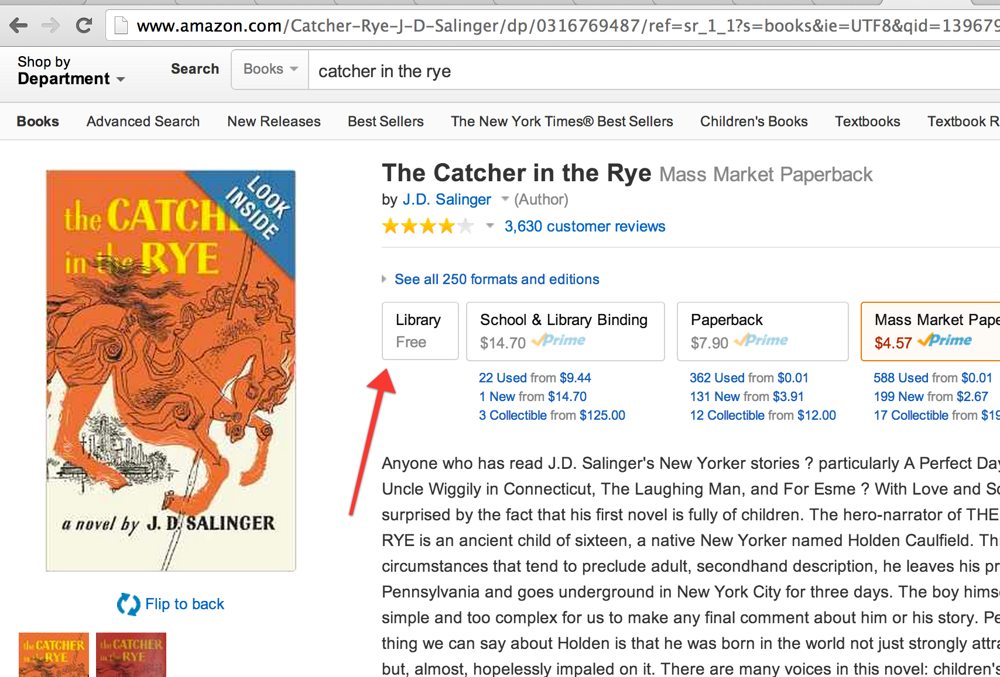

robinbook
=========

A Chrome plugin that, when browsing books on Amazon, will add a link to that book in the New York Public Library.

This was built for the [Spring 2014 Hack Upstate](http://hackupstate.com/) hackathon. Original idea by [Colin Pugh](http://twitter.com/cpugh29). Refinement, help, encouragement, and beers with Colin Pugh, Joseph Novek, [Gordon Zheng](http://twitter.com/capable_monkey), Dan Clark, and [Chris Campos](http://twitter.com/MrChrisCampos) were also a big part of this being a huge amount of fun.

## Installation

You can get the built plugin on the [Chrome Web Store](https://chrome.google.com/webstore/detail/robinbook/eeibepmoiemjmmodcghabhnkpfiimgjc).

## Contributing

I'll probably leave this alone for a while and ponder the terrible state of library IT. We learned some interesting things about library websites during the hackathon.

If you want to contribute, I absolutely welcome you to open tickets and/or send pull requests.

## License

This is released under the MIT License. Full text is in the [LICENSE](./LICENSE) file.
